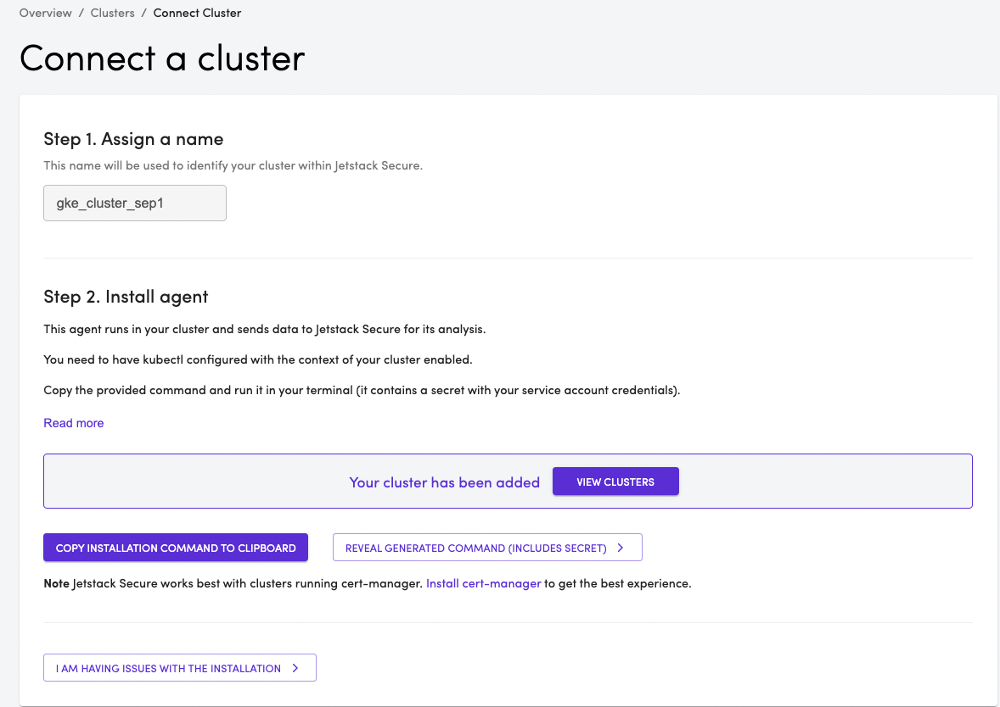

## Connecting a cluster to Jetstack Secure 
- Login to https://platform.jetstack.io , click Clusters and then click on **Connect New Cluster** button
- Provide a name for the cluster, copy the generated command and paste it to run in your cluster.
- You can also download the instructions and store it to run at a later time.
- The UI will show the following after the agent is up and running. 

