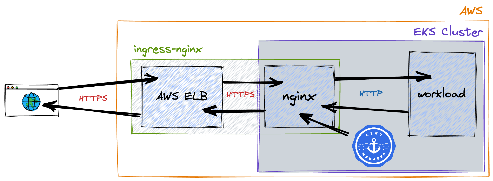
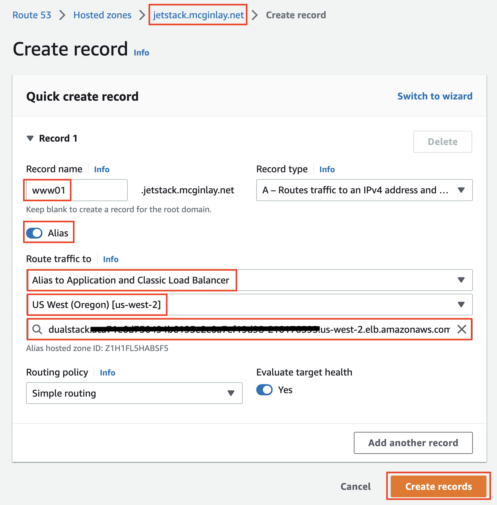

# EKS with ingress-nginx and cert-manager

What are the minimum steps required to see `cert-manager` working on Amazon EKS?

## Introduction

Your goal here is to enforce secure TLS communication between any browser on the internet and a single containerized workload running in EKS.
Managed Kubernetes services, like EKS, provide a quick and simple way to expose your workloads to the internet via load balancers.

In this scenario, the browser will expect HTTPS (which implies TLS) but the workload itself only supports HTTP.
These instructions assume that you are unable, or unwilling, to modify the container image or its configuration.

We can implement a [reverse proxy](https://en.wikipedia.org/wiki/Reverse_proxy) solution by positioning an nginx instance between an internet-facing load balancer (AWS ELB) and the HTTP workload.
The nginx instance can then be loaded with X.509 certificates making it responsible for TLS termination.
To clarify, this means traffic touching the internet is HTTPS whilst traffic touching the workload is plain old HTTP.

`ingress-nginx` is a packaged version of nginx for deployment inside Kubernetes clusters.
Instead of having to edit nginx configuration files by hand, `ingress-nginx` supports declarative configuration via Kubernetes ingress resources.
Those ingress resources can reference certificates stored as Kubernetes secrets.
On its own, `ingress-nginx` is unable to create certificates or renew them before they expire.
That's where `cert-manager` comes in.



## Prerequisites

- The necessary client tools installed
- Access to a running EKS cluster via `kubectl`
- Full control of your own domain (or subdomain) surfaced as a **hosted zone** in AWS Route53.

We assume your AWS resources are hosted in the **us-west-2** region.

These instructions depend upon content from this directory in the repo so `git clone` this repo and `cd` as appropriate.

## Deploy demo workload and service

Run the following snippet to stand up a demo application which you will go on to secure.

```bash
kubectl create namespace demos
kubectl -n demos run demo-app --image amcginlay/test-container:1.0.0 --port 80
kubectl -n demos expose pod demo-app --port 8080 --target-port 80
```

You can assume your workload is OK for now and turn your attention to the plumbing.

## Deploy the NGINX ingress controller

Deploy the NGINX ingress controller as follows.
```bash
helm repo add ingress-nginx https://kubernetes.github.io/ingress-nginx && helm repo update
helm install ingress-nginx ingress-nginx/ingress-nginx --namespace ingress-nginx --create-namespace
```

Ensure the required service object has appeared before moving on.
```bash
kubectl -n ingress-nginx get service ingress-nginx-controller
```

Observe that the `controller` service is surfaced inside your AWS account as an internet-facing load balancer resource.

```bash
aws elb describe-load-balancers --query "LoadBalancerDescriptions[].DNSName"
```

After a 2-3 mins the load balancer will begin returning "404 Not Found" responses.
This is the expected response as there are no routing rules in place yet.
```bash
elb_dnsname=$(kubectl -n ingress-nginx get service ingress-nginx-controller -o jsonpath='{.status.loadBalancer.ingress[0].hostname}')
curl -L http://${elb_dnsname}
```

## Deploy cert-manager

In order to deploy a **secure** website over HTTPS you will need to provide a valid certificate.
That's what **cert-manager** is all about - it secures your sites, and ensures that they **stay secure**.
(1-2 mins)
```bash
helm repo add jetstack https://charts.jetstack.io && helm repo update
helm install cert-manager jetstack/cert-manager --namespace cert-manager --create-namespace --version v1.10.0 --set installCRDs=true
```

You can observe the newly created cert-manager objects as follows.
```bash
kubectl -n cert-manager get deploy,svc
```

You've also got a few more Custom Resource Definitions (CRDs) at your disposal which we'll use in a moment.
```bash
kubectl api-resources --api-group=cert-manager.io
```

## Create Let's Encrypt (ACME) issuer

You will need a trusted certificate obtained from a Certificate Authority (CA).
Native cert-manager issuer objects and their [external variants](https://cert-manager.io/docs/configuration/external/) provide appropriately configured gateways to CAs and alternate certificate request handlers.
Your cert-manager instance will now have the **Let's Encrypt** CA made available to use with `ingress-nginx`.
```bash
cat ./issuer.yaml # view what you'll be applying
kubectl -n demos apply -f ./issuer.yaml
```

Check on the status of the issuer after you've created it
```bash
kubectl -n demos describe issuer letsencrypt | grep Message
```

If the message says "The ACME account was registered with the ACME server" then you're good to go.

## Configure Route53

NOTE if you wish to complete this section using the AWS CLI, check out the necessary steps detailed in the [addendum](./addendum/README.md).

To pair your own web domain with an AWS load balancer you will need full control of the appropriate **hosted zone** in a public DNS service.
These instructions assume that service is AWS Route53.

The following section details the assignment of a new Route53 ALIAS record to your domain (or subdomain) which can route traffic to the ELB you created previously.

NOTE using day of the month in the DNS record (below) is a simplistic way to test out your solution using **production-strength** certificates whilst navigating the CA's [Duplicate Certificate Limit](https://letsencrypt.org/docs/duplicate-certificate-limit/).

Start by setting variables to represent the DNS record name you wish to target.
```bash
hosted_zone=jetstack.mcginlay.net   # IMPORTANT - adjust as appropriate
record_subdomain_name=www$(date +"%d") # e.g. www01 - where the digits indicate the day of the month (for testing)
export dns_record_name=${record_subdomain_name}.${hosted_zone}
echo
echo "------------------------------------------------------------------"
echo "The DNS record you will now create is: ${dns_record_name}"
echo "------------------------------------------------------------------"
```

Head over to https://console.aws.amazon.com/route53/v2/hostedzones and create your new DNS record in your hosted zone as shown below.



Once the DNS record has propagated, the new endpoint will also respond with the familiar "404" status page from `nginx`.
Wait for this to happen before continuing.
```bash
curl -L http://${dns_record_name}
```

Let's deal with that 404 response.

## Creating an ingress rule

As mentioned, your nginx instance is not currently loaded with any routing rules, hence the "404" responses we currently see via the load balancer.
Outside the world of Kubernetes, "vanilla" nginx would source its rules from a config file (`nginx.conf`).
ingress-nginx works the same, except now the ingress-nginx controller and ingress objects work together to codify those config file changes on your behalf.

As you create your first ingress object, observe the use of the `ingressClassName` attribute which associates your ingress rule with a specific variant of ingress controller (`nginx`), and the `cert-manager.io/issuer` annotation which associates your rule with your issuer object (`letsencrypt`).
```bash
export certificate=$(tr \. - <<< ${dns_record_name})-tls
cat ./ingress.yaml.template                                          # view the template
cat ./ingress.yaml.template | envsubst                               # view what you'll actually be applying
cat ./ingress.yaml.template | envsubst | kubectl -n demos apply -f -
```

You can observe your ingress object as follows.
Note that this supports traffic on port 443 (HTTPS).
```bash
kubectl -n demos get ingress demo-ingress
```

Your ELB will now **securely** route all traffic via HTTPS to your demo workload.
```bash
curl -Ls https://${dns_record_name}
```

At this point you can navigate to the `${dns_record_name}` URL in any browser and you will see padlock icons without warnings meaning HTTPS is enforced and working.
By observing the output in a browser you can also determine that the request your workload received was plain old HTTP.
This means NGINX done its job - it has routed traffic from the ELB to your workload, meanwhile providing a transparent termination point for the TLS encryption.

## So, what just happened?

cert-manager is aware of ingress objects.

It deduced from your ingress object that traffic to your demo app is intended to be secured by Let's Encrypt and built a Kubernetes certificate object for you to represent that requirement.
The presence of the new certificate ultimately causes a certificate request (CR) to be issued by cert-manager.
Each CR that is successfully fulfilled causes the associated certificate to become paired with a secret object containing the key material returned from the CA.

You can view the paired objects as follows.
```bash
kubectl -n demos get certificate ${certificate}
kubectl -n demos describe secret ${certificate} | tail -4
```

The data items in the secrets are base64 encoded.
If you wish, you can use `openssl` to see the key material in its more natural form.
```bash
kubectl -n demos get secret ${certificate} -o 'go-template={{index .data "tls.crt"}}' | base64 --decode | openssl x509 -noout -text | head -11
```

As expected for an ingress controller, ingress-nginx is also aware of ingress objects.

With the secret containing a key material now in place, ingress-nginx rewrites the nginx config file and signals nginx to reload, securely activating the route(s) to your workload.

This demo is complete.

## Undo Steps

```bash
helm uninstall -n cert-manager cert-manager
helm uninstall -n ingress-nginx ingress-nginx
kubectl delete namespace cert-manager ingress-nginx demos
```

Then remove the DNS record from Route53
