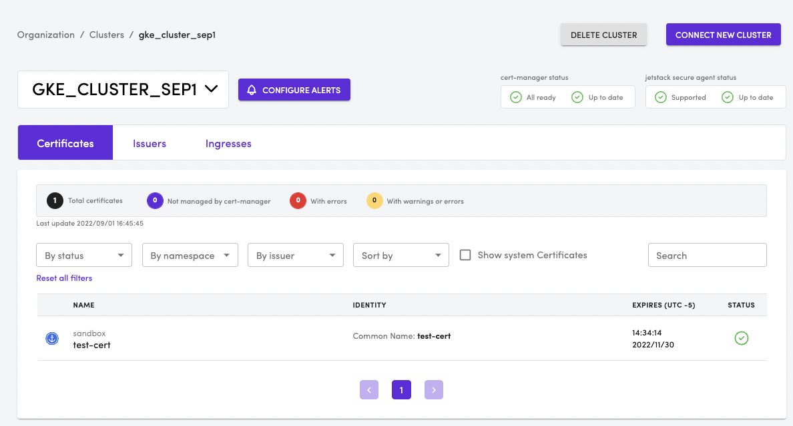

# Creating a certificate

**NOTE**:  `cert-manager` is installed with it's auto-approver controller disabled. There is also no out of the box `allow-all` policy installed automatically. This is intentional. This means every certificate request **must** be manually approved.

**NOTE**: Jetstack cert-manager CLI is a convenient tool to manage manual approvals, renewals. Also provides an easy way to test out things. Install the CLI from [here](https://cert-manager.io/docs/usage/cmctl/#installation) 

We are now ready to try a simple case of requesting a certificate using `cert-manager`. 
- Change directory to go to enterprise-cert-manager directory
```
cd enterprise-cert-manager
```
- Review the file `enterprise-cert-manager/cert-manager/sample-cert.yaml`. This will create a `self-signed` issuer in a namespace called `sandbox` and attempt to create a certificate with name `test-cert`
- Run 
```
make init create-cert
```  
- Validate if the certificate is ready and good to go
Run the below command and you will notice that the Ready state of the certificate is **False**
```
kubectl -n sandbox get Certificate 
```

```
NAME        READY   SECRET      AGE
test-cert   False   test-cert   5s
```
- Let's take a look at the corresponding `CertificateRequest` resource. For every `Certificate` a corresponding `CertificateRequest` and on successful fulfillment of certificate a TLS secret is created. 
- Run the below command and you will notice that neither the `Approved` or `Denied` flag is set. 
```
kubectl -n sandbox get CertificateRequest
```
```
NAME              APPROVED   DENIED   READY   ISSUER              REQUESTOR                                            AGE
test-cert-cctmp                               selfsigned-issuer   system:serviceaccount:jetstack-secure:cert-manager   6m38s
```
- Run the below command and among other things you will see the following in the `Events`
```
kubectl -n sandbox describe CertificateRequest test-cert-cctmp
```
Event Output
```
Events:
  Type    Reason       Age                 From                    Message
  ----    ------       ----                ----                    -------
  Normal  Unprocessed  1s (x10 over 8m6s)  policy.cert-manager.io  Request is not applicable for any policy so ignoring
```

In the subsequent usecases will work on creating policies that will automatically approve or deny based on certain conditions. However, as we do not have any policy at this time, we will need to manually approve the request for a certificate.
- Run the following to approve the certificate request . 
**NOTE** The name of the `CertificateRequest` resource will be different in your environment as it is suffixed with an auto generated random string. 

```
cmctl -n sandbox approve test-cert-cctmp
```

```
Approved CertificateRequest 'sandbox/test-cert-cctmp'
```
- The CertificateRequest is now approved and because of that the Certificate will be now issued. 
- This can be verified by running 
```
kubectl get Certificate -n sandbox
```
```
NAME              APPROVED   DENIED   READY   ISSUER              REQUESTOR                                            AGE
test-cert-cctmp   True                True    selfsigned-issuer   system:serviceaccount:jetstack-secure:cert-manager   11m
```

## Viewing the certificate info in the dashboard
The test cert that we created will show up in the dashboard when you access your cluster. 
