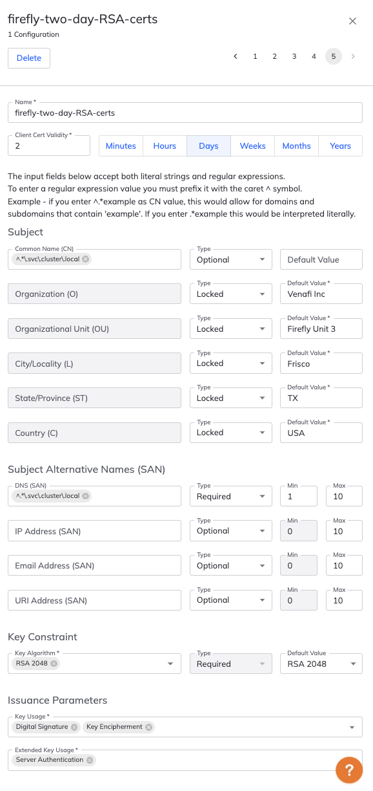

# Configuring and running Venafi Firefly 

## Requirements  
- You are licensed to use Venafi TLS Protect for Kubernetes and have the credentials to pull enterprise cert-manager images from Venafi's private registry
- You have access to Venafi TLS Protect Cloud and the **Firefly** addon to create intermediate CA's along with policies to govern them. 

## Assumptions 
- For the purposes of this demo, **Firefly** will be configured to run in Kubernetes along with the rest of the workloads. In production environments it is recommended to isolate **Firefly** by running it in a dedicated nodepool or outside of the cluster in it's own VM or physical machine. When running outside the cluster Firefly will authenticate using `kubeconfig` associated with the `ServiceAccount` tied to a Firefly `Deployment`
- `CertificateRequest` resources will comply to the policies associated with Firefly configured in Venafi Control Plane. Most enterprises also run Venafi policies in-cluster with Venafi TLSPK Enterprise Policy Approver. If `policy-approver` is deployed in cluster, a `CertificateRequestPolicy` must be created that allows all for the **Firefly** issuer to avoid conflicting policies.    

## Configuring Venafi Firefly 
Login into [Venafi TLS Protect Cloud](https://ui.venafi.cloud) and access the **Firefly** addon from the product switcher in the upper right corner. If you don't have an account you can sign up for a 30 day trial.


You can switch between TLS Protect Cloud and Firefly at any time. You will be presented with the last accessed module when you login.

### Creating a Sub CA Provider 
The first step to getting started with **Firefly** is to create a subordinate CA provider. Several upstream CA's are supported but for the purposes of setting up this demo environment 
- Click "Sub CA Providers" in the top menu
- Click the "New" -> "Venafi Built-In CA" button. 

> **NOTE** 
> Sub CA Provider can be created using the Venafi API as well. There are several helper `Makefile` targets showing how to use the Venafi APIs. [Venafi Developer Central](https://developer.venafi.com) is a good place to start to understand the various APIs and recipes that can be used. 

In the presented screen provide the details for the subordinate CA. An example is included in the screenshot below. The common name for the CA that will be bootstrapped is set as `firefly-built-in-180.svc.cluster.local` with the key algorithm as `RSA 2048`. Set the rest of the subject information that best suits your needs. The sample uses the Venafi Built-In CA. For producton, it is recommended to use the organization's CA.


Make sure to save and review the Sub CA Provider you create. 
### Create a policy for certificates issued by Firefly
As a next step , we will create a policy that will be used by the **Firefly** issuer for issuing certificates in cluster. Venafi Firefly provides a very comprehensive policy model for governing how certificates are issued for workloads. Read the TLS Protect Cloud documentation for various options. 

To create a policy 
- Click "Policies" in the top menu
- Click New and in the presented screen provide the values for the policy. 

All fields are self explanatory. For information about what the "Type" means read the documentation. For e.g Optional means it is optional to provide a value.  In the sample policy shown below 
- the name of the policy is *firefly-two-day-RSA-certs*
- the validity of all certs issued by **Firefly** is 2 days 
- the subject enforces that common name / DNS SAN must end with `.svc.cluster.local`
- the rest of the subject fields are locked to a certain value and the information provided in the CSR will be not used. 
- the key constraint is set to "Required" and the only allowed value is **RSA 2048**
- the issuance parameters are set with specific values that will be set in the issued certificate.



Make sure to save and review the policy you create. 

**NOTE** Create two additonal policies similar to above and name them *firefly-ten-day-RSA-certs* and *firefly-hundred-day-RSA-certs* . For the former set the validity to 10 days and for the latter set it to 100 days. 

The idea is to have different policies that cater to different scenarios that *Firefly* will fulfill. 

### Creating a service account to tie Firefly runtime to Venafi Control Plane. 
Before you create a service account in the UI, generate a public/private key pair. You can choose a mechanism that works best for you. For this demo simply run the following. 

```
openssl genrsa -out firefly-key.pem 2048
openssl rsa -in firefly-key.pem -pubout > firefly-key.pub
```

The public key will be used in the service account configuration in the Venafi Control Plane. The private key will be mounted in the Kubernetes pod. For the purposes of a simple demo, we will create a Kubernetes secret with the key. This is not recommended for production environments. 

Creating a service account also requires a team and associated members. In the UI, click on Teams , create a team, define membership rules based on SSO claims or assign people directly. This demo is not covering the exact steps for creating Teams and assumes you have a team defined. 

Click on Service Accounts and set the required fields. 
The sample service account as shown the picture below has the following settings
- Name : firefly-service-account 
- Owning Team : firefly-demoers 
- Validity : 365 days
- Public Key : The contents of firefly-key.pub 

Save the values and note the *ClientID* This client id is the glue between Venafi Control Plane and Firefly runtime. 


### Creating a configuration for Firefly runtime operations
This is the final step in the process of setting up Firefly for runtime operation. **Firefly** at runtime is associated with a configuration that holds one or more policies. We have created three policies. Each of the policy will cater to different types of workloads associated with a single configuration. 

For e.g the policy created to issue certs with validity of 2 days is likely for highly ephemeral workloads. The 10 day and the 100 day certs may be applicable to different types of workloads.  

To create a configuration,
- Click "Configurations" in the top menu 
- Click New and in the presented screen provide a name and the required fields. 

The required fields on the screen are self explanatory. For addtional details, read the documentation. 
- the name of the config is set to `firefly-config-for-bank-app`
- the selected Sub CA Provider is what we created as a Sub CA Provider. In this example it is `firefly-provider-with-built-in-ca`
- the associated policies are the policy we created earlier. You should associate three policies as shown in the screenshot below. 
- the service account is the one we created earlier as well. 

 Note the metrics below the name of the configuration in the screenshot. As **Firefly** runs, metrics associated with number of certificates issued is shown when you return to the configuration.  

> **Warning**
>At the time of this writing, URL field for JWKS is required but as we don't have one in this demo it is set to a random string. 


Make sure to save and review the configuration you create. 

## Installing the required Firefly components in Kubernetes

- The [resources](../firefly/config/firefly-resources.yaml) to deploy **Firefly** was generated using `helm template`. In the near future the instructions will be changed to install directly from the Venafi OCI registry. 
- While the **Firefly** demo can be deployed standalone, it is part of the larger demo set that is in this repo and utilizes the same `settings.sh-template` for configuring the environment. If you don't care about rest of the demos, you don't need to setup all the required variables in your local `settings.sh`
- You are still required to set the variables used in [Makefile](../firefly/Makefile) in `settings.sh`. All variables start with prefix **JS_**
- Running **Firefly** in Kubernetes requires enterprise cert-manager (available via TLS Protect Kubernetes) and some of the variables set in `settings.sh` is for connecting to Venafi's private registry to pull the images. 
- Instructions to get credentils to access enterprise builds are [here](../README.md#assumptions)

### Setting up the environment 
- Follow the instructions to set up your local environment [here](../README.md#setting-up-your-environment)
- More specifically to run **Firefly** you will need to set 
  - JS_ENTERPRISE_CREDENTIALS_FILE (Docker registry secret downloaded from TLS Protect for Kubernetes)
  - JS_DOCKER_REGISTRY_EMAIL (Any email id that will be set as --docker-email in the docker-registry secret)
  - JS_VENAFI_CLOUD_API_KEY (Your Venafi TLS Protect Cloud API Key)
  - JS_VENAFI_FIREFLY_CLIENT_ID (The client id from the Venafi Firefly Service account associated with the configuration)

### Preparing the cluster to run Firefly

### STEP 1
Change to directory `firefly`. Instructions assume that you are running everything from the directory `demos/firefly`

Run 
```
make init
```
Running `init` will 
- create a directory called `artifacts` and all the necessary files required to deploy **Firefly** will be generated here. 
- create two namespaces in your cluster `sandbox` and `cert-manager` 
- configure the `cert-manager` to have a `Secret` called `docker-registry` that will contain the credentials to pull Venafi TLS Protect for Kubernetes images. For the purpose of this demo the only image that will be pulled is the enterprise cert-manager

### STEP 2
Review the file [create-kube-config.sh](../firefly/create-kube-config.sh) 
What does `create-kube-config.sh` do?
- It checks if a service account called `firefly` exists in the namespace `cert-manager`
- If it doesn't exist it creates one
- It then creates a service account token mapped to `ServiceAccount` `firefly`
- Finally, it generates a configuration using the client certificate from the token to create a `kubeconfig`. 
- Most importantly, it ties the `ServiceAccount` associated with **Firefly** `Deployment` to the token for the required RBAC's. Essentially this `kubeconfig` represents the service account `firefly` used by the `Deployment` 

Running the following target **DOES NOT** create a kubeconfig. It only prints the command for you to run. **Only you have the credentials to run it**. 

Run 
```
make create-kubeconfig
```
You will see the following output 
```
Create kubeconfig. Run the shell script like this... 
Replace CLUSTER_FULLNAME with your cluster name and CLUSTER_URL with your cluster URL. Example below for AWS EKS.

CLUSTER_FULLNAME=arn:aws:eks:<your-region>:<your-account>:cluster/<your-cluster-name> CLUSTER_URL=https://<whatever-you-see-in-the-url>.eks.amazonaws.com ./create-kube-config.sh

The Service account associcated kubeconfig is generated - written to console as well as to file artifacts/kubeconfig.yaml
```
Replace the value of **CLUSTER_NAME** with your cluster name and the **CLUSTER_URL** with your cluster URL. The example above is for EKS but replace it with relevant cluster name and url for other Kubernetes distributions. 

You should see a new file called `artifacts/kubeconfig.yaml`. Review it. 
Additionally, run 
```
kubectl get sa -n cert-manager
```
and you will see

```
NAME                      SECRETS   AGE
default                   0         54s
firefly                   0         12s
```
If you want to inspect the associated token optionally, run 

```
kubectl -n cert-manager get secret -o jsonpath='{.items[?(@.metadata.annotations.kubernetes\.io/service-account\.name=="firefly")].metadata.name}'
```
and you will see `firefly-token-<random-uid>` 

### STEP 3

**Firefly** requires cert-manager to be installed and running. This step installs cert-manager for you. While this demo instructions installs cert-manager in the `cert-manager` namespace our install instructions for TLS Protect Kubernetes will be in a different namespace. 

Run
```
make install-cert-manager
```
Successful installation of cert-manager will return the control back to your console. 

To review that cert-manager is deployed and all pods are `Running`, run

```
kubectl get pods -n cert-manager
```
to see
```
NAME                                       READY   STATUS    RESTARTS   AGE
cert-manager-cainjector-68847fbb5b-lpbhw   1/1     Running   0          9m
cert-manager-cfc9ff49d-4hrlm               1/1     Running   0          9m
cert-manager-webhook-97984bd5b-5rs7v       1/1     Running   0          9m
```

### STEP 4

Before executing this step review the configuration for Firefly. The config is in [config/firefly-config.yaml](../firefly/config/firefly-config.yaml)

There is nothing to change here. The values will be replaced and a new file generated in the artifacts directory. 
Note that property called `instanceNaming`. The name set here will be prepended to the `CommonName` that we set when we created the Sub CA provider. For e.g the issuing certificate will be named `<TIMESTAMP> firefly-built-in-180.svc.cluster.local` 

Additionally, if interested review the resources that will be deployed. All firefly resources are located in [config/firefly-resources.yaml](../firefly/config/firefly-resources.yaml)

> **NOTE** 
> `firefly-resources.yaml` is generated via a Helm Chart that is currently (at the time of this writing) not published. Once published this file will be deleted and the deployment will be done via `helm install`

To deploy **Firefly**  run,

```
make deploy-firefly
```
The output of the deploying **Firefly** will look like below
```
configmap/firefly-config created
Warning: resource serviceaccounts/firefly is missing the kubectl.kubernetes.io/last-applied-configuration annotation which is required by kubectl apply. kubectl apply should only be used on resources created declaratively by either kubectl create --save-config or kubectl apply. The missing annotation will be patched automatically.
serviceaccount/firefly configured
customresourcedefinition.apiextensions.k8s.io/issuers.firefly.venafi.com created
clusterrole.rbac.authorization.k8s.io/firefly:approver-firefly-venafi-com created
clusterrole.rbac.authorization.k8s.io/firefly created
clusterrolebinding.rbac.authorization.k8s.io/firefly:approver-firefly-venafi-com created
clusterrolebinding.rbac.authorization.k8s.io/firefly created
role.rbac.authorization.k8s.io/firefly:leader-election created
rolebinding.rbac.authorization.k8s.io/firefly:leader-election created
deployment.apps/venafi-firefly created
```
Several resources will be created to setup the appropriate RBAC controls for the deployment. 

Review that **Firefly** is indeed deployed by running

```
kubectl get pods -n cert-manager
```
and you will see

```
NAME                                       READY   STATUS    RESTARTS   AGE
cert-manager-cainjector-68847fbb5b-lpbhw   1/1     Running   0          45s
cert-manager-cfc9ff49d-4hrlm               1/1     Running   0          45s
cert-manager-webhook-97984bd5b-5rs7v       1/1     Running   0          45s
venafi-firefly-757fd6b889-nltrv            1/1     Running   0          16s
```

Additionally, review the log by running
```
kubectl logs venafi-firefly-757fd6b889-nltrv -n cert-manager
```
Partial output at the end will say something like this that tells **Firefly** is deployed and running as expected. 

```
I0521 01:14:09.980660       1 vaas.go:229] agent/bootstrap/vaas "msg"="generate certificate signing request" 
I0521 01:14:10.026096       1 controller.go:227] agent/controller/manager "msg"="Starting workers" "controller"="certificaterequest" "controllerGroup"="cert-manager.io" "controllerKind"="CertificateRequest" "worker count"=1
I0521 01:14:10.135117       1 client.go:263] agent/bootstrap/vaas/client "msg"="send request to VaaS to issue intermediate certificate" 
I0521 01:14:10.236892       1 client.go:295] agent/bootstrap/vaas/client "msg"="retrieve issued intermediate certificate from VaaS" 
E0521 01:14:10.281764       1 client.go:518] agent/bootstrap/vaas "msg"="failed to execute the call, will retry" "error"="intermediate certificate with id ca624be0-f774-11ed-ba16-2b1da557b699 is not yet issued, current status: PENDING" 
I0521 01:14:10.782612       1 client.go:295] agent/bootstrap/vaas/client "msg"="retrieve issued intermediate certificate from VaaS" 
I0521 01:14:10.828352       1 vaas.go:123] agent/bootstrap/vaas "msg"="issued intermediate certificate from VaaS" "CN"="2023-05-20-2014 firefly-built-in-180.svc.cluster.local" "id"="ca624be0-f774-11ed-ba16-2b1da557b699"
I0521 01:14:10.829375       1 inmemory.go:47] agent/signer/inmemory "msg"="stored in memory certificate private key bundle" 
I0521 01:14:10.829403       1 renewer.go:136] agent/agent_renewer "msg"="fetched intermediate certificate from bootstrap" "CN"="2023-05-20-2014 firefly-built-in-180.svc.cluster.local"
```

### STEP 5
Let's validate that **Firefly** can issue certificates 

Review the file [config/certificate.yaml](../firefly/config/certificate.yaml) 

**IMPORTANT** The `policy-name` annotation drives what policy is used for fulling the certificate request. The teams requesting certificates just need to know the name of the policy and the required properties to send in the certificate. Many of the certificate properties have been locked by the administrator and/or set as defaults.  The `firefly.venafi.com/policy-name` annotation for each of the three certificates is set to the a different policy.

Run 
```
make create-certificates
```

This will create the certificates in the `sandbox` namespace and can be validated by running,

```
kubectl get Certificate -n sandbox
```
The output will be 

```
NAME                                    READY   SECRET                                  AGE
cert-hundred-days-1.svc.cluster.local   True    cert-hundred-days-1.svc.cluster.local   3m
cert-ten-days-1.svc.cluster.local       True    cert-ten-days-1.svc.cluster.local       3m
cert-two-days-1.svc.cluster.local       True    cert-two-days-1.svc.cluster.local       3m
```

Optionally, look at the associated `CertificateRequest` and `Secret` resources. 
To look at `CertificateRequest` resources run 

```
kubectl get CertificateRequests -n sandbox 
```
The output will be

```
NAME                                          APPROVED   DENIED   READY   ISSUER    REQUESTOR                                         AGE
cert-hundred-days-1.svc.cluster.local-sbw7t   True                True    firefly   system:serviceaccount:cert-manager:cert-manager   3m
cert-ten-days-1.svc.cluster.local-x6djj       True                True    firefly   system:serviceaccount:cert-manager:cert-manager   3m
cert-two-days-1.svc.cluster.local-kjsqd       True                True    firefly   system:serviceaccount:cert-manager:cert-manager   3m
```
Note that the issuer is set to **Firefly**

To confirm the validity of each of the certificate optionally run 

Run the following , 
```
kubectl get secret cert-two-days-1.svc.cluster.local -n sandbox -o jsonpath="{.data.tls\.crt}" | base64 -d | openssl x509 -text | grep  CN=cert-two-days-1.svc.cluster.local -B4
```
to see

```
        Issuer: C=US, ST=TX, L=Frisco, O=Venafi Inc, OU=Firefly Unit, CN=2023-05-20-2014 firefly-built-in-180.svc.cluster.local
        Validity
            Not Before: May 21 03:16:00 2023 GMT
            Not After : May 23 03:16:00 2023 GMT
        Subject: C=USA, ST=TX, L=Frisco, O=Venafi Inc, OU=Firefly Unit 3, CN=cert-two-days-1.svc.cluster.local
```

Run the following, 
```
kubectl get secret cert-ten-days-1.svc.cluster.local -n sandbox -o jsonpath="{.data.tls\.crt}" | base64 -d | openssl x509 -text | grep  CN=cert-ten-days-1.svc.cluster.local -B4
```

to see 
```
        Issuer: C=US, ST=TX, L=Frisco, O=Venafi Inc, OU=Firefly Unit, CN=2023-05-20-2014 firefly-built-in-180.svc.cluster.local
        Validity
            Not Before: May 21 03:15:50 2023 GMT
            Not After : May 31 03:15:50 2023 GMT
        Subject: C=USA, ST=TX, L=Frisco, O=Venafi Inc, OU=Firefly Unit 2, CN=cert-ten-days-1.svc.cluster.local
```
Run the following
```
kubectl get secret cert-hundred-days-1.svc.cluster.local -n sandbox -o jsonpath="{.data.tls\.crt}" | base64 -d | openssl x509 -text | grep  CN=cert-hundred-days-1.svc.cluster.local -B4
```
to see
```
        Issuer: C=US, ST=TX, L=Frisco, O=Venafi Inc, OU=Firefly Unit, CN=2023-05-20-2014 firefly-built-in-180.svc.cluster.local
        Validity
            Not Before: May 21 03:15:39 2023 GMT
            Not After : Aug 29 03:15:39 2023 GMT
        Subject: C=USA, ST=TX, L=Frisco, O=Venafi Inc, OU=Firefly Unit 1, CN=cert-hundred-days-1.svc.cluster.local
```

## Access the Venafi Control Plane to view the Issuer Certificates and the associated metrics

Access the UI,
- Click "Issuer Certificates" in the top menu 

All the Issuer certificates and the metrics will be presented for the security team to monitor and review as shown below 


If TLS Protect for Kubernetes agent is deployed in-cluster, the dashboard will show the certificate details.  Login to TLSPK dashboard for detailed access to each certificate. 

## Cleanup
To clean up everything in your Kubernetes cluster, just run

```
make cleanup
```
**Advanced** If you also want to clean up the issuing certificates from TLS Protect Cloud there are a couple of helper targets. This will also help understand how the Venafi Control Plane API's work. More details at [developer.venafi.com](developer.venafi.com)  

Run `make get-firefly-intermediate-certificate-ids`. This will list the id and common name for all issuing certificates. Change the target `delete-firefly-intermediateCertificates` to set the id and then run `make delete-firefly-intermediateCertificates` to remove issuing certificate.
