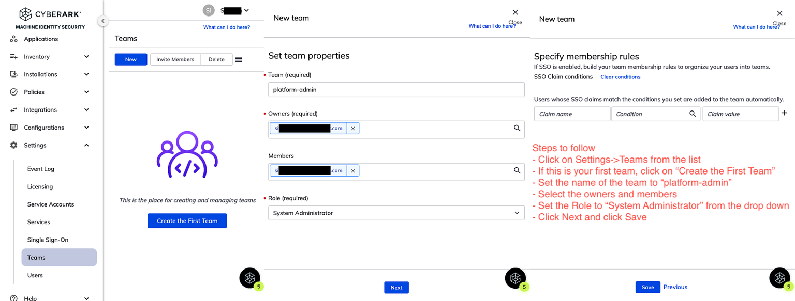
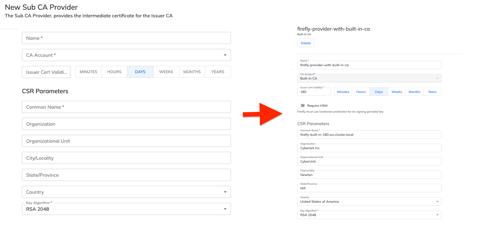
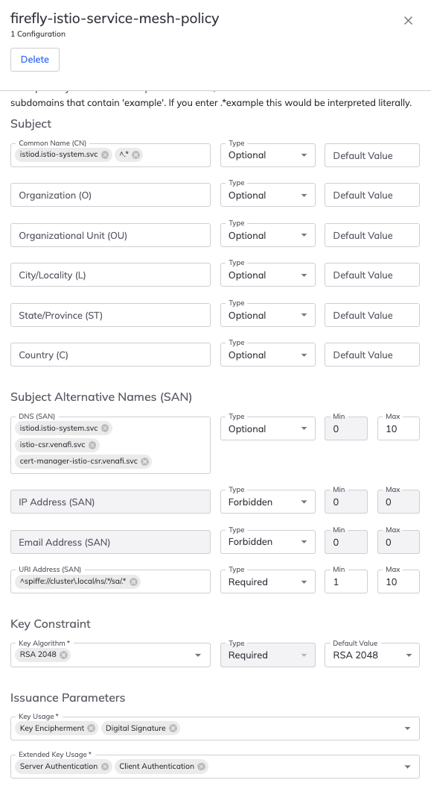
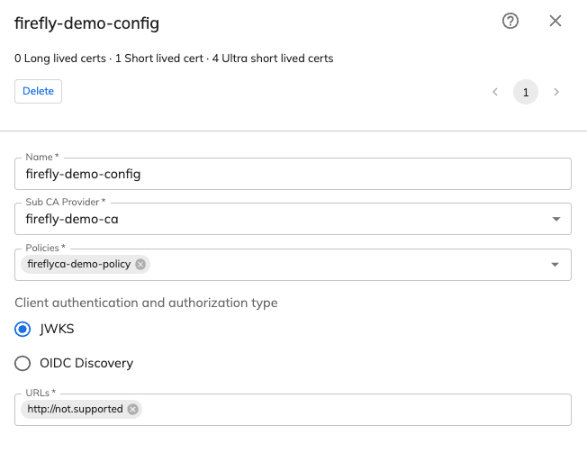

# Cyberark Certificate Manager and Workload Identity Manager

## Requirements
You have access to https://{your-tenant}.venafi.cloud/

## Tenant configuration
The following steps will need to be performed only one time for each tenant. This is to ensure you have all the configurations in place for demos.

### Creating a Team
A team represents a collection of users with an associated role. We need to create at least one team. The steps to create a team is captured in the image below.

### Configuring certificate issuing template
While you can configure multiple Certificate Authorities and various issuing templates, for this demo we will use the Default template that already exists. The default template is configured out of the box to issue certificate with a validity period of 90 days. For some of the use cases we will issue certificates with a duration longer than 90 days. Let's change the default template to support that. 

Access **Policies -> Issuing Templates -> Click on Default**
Now, simply change the validity from 90 to 365 and click **Save**

### Configuring Cyberark Workload Identity Manager

#### Create SubCA provider 
In order configure Cyberark Workload Identity Manager, we have to perform a few steps. The first step is to create a subCA provider. The information provided here will be used by runtime to bootstrap an ephemeral CA. 

To create a subCA provider, Access **Policies -> Firefly Sub CA Providers** 
Click on **New Sub CA Provider -> Venafi Built-In CA** and provide the following values 

| Property          | Type |
| :---              |    :----:   | 
| Name   | firefly-provider-with-built-in-ca        | 
| CA Account      | `Built-In CA`       |
| Issuer Cert Validity   | 180 Days     | 
| Common Name   | firefly-built-in-180.svc.cluster.local        | 
| Organization   | Cyberark Inc        | 
| Organization Unit   | CyberUnit        | 
| City/Locality   | Newton        | 
| State/Province   | MA        |
| Country   | United States Of America        |  
| Key Algorithm   | RSA 2048        |  

If you prefer to have different CSR parameters, you can set to whatever you need. Here's how the subCA configuration will look like after you have saved it. 

#### Create policies
As a next step , we will create a policy that will be used by the **Workload Identity Manager** issuer for issuing certificates in cluster. The policy model for governing how certificates are issued for workloads is very comprehensive. Read the product documentation for additional details. 

> **NOTE**  Make sure that the policy name matches as it's used during runtime. 

To create a policy 
- Click "Policies / Firefly Issuance Policies" in left panel 
- Click New and in the presented screen provide the values for the policy. 
- Save the policy.

##### Policy  `firefly-istio-service-mesh-policy`
| Property          | Value |             Type |    Default Value |
| :---              |    :----:   |        :----:   | :----:   |
| Name   | `firefly-istio-service-mesh-policy`        |  | |
| Client Cert Validity      | 1 Hours       | | |
| Common Name   | `^.*`     | Optional | `Leave it empty` |
| Organizaton   | `Leave it empty`        |Locked | Cyberark Inc |
| Organization Unit   | `Leave it empty`        | Locked | CloudApps Unit | 
| City/Locality   | `Leave it empty`        | Locked | Newton | 
| State/Province   | `Leave it empty`        | Locked | MA | 
| Country   | `Leave it empty`        | Locked | USA | 
|    |         |  |  | 
|    |         |  |  | 
| DNS(SAN)   | `^.*`        | Optional | Min=0, Max=10 | 
| IP Address   | `Leave it empty`        | Forbidden | Min=0, Max=0 | 
| Email Address   | `Leave it empty`        | Forbidden | Min=0, Max=0 | 
| URI Address   | `^spiffe://cluster\.local/ns/.*/sa/.*`        | Required | Min=1, Max=10 | 
|    |         |  |  | 
|    |         |  |  | 
| Key Constraint   | Select RSA 2048        | Required | RSA 2048  | 
| Key Usage   | Key Encipherment   Digital Signature        | 
| Extended Key Usage   | Server Authentication   Client Authentication        | | 

> > Review the policy[image below]. The `Client Cert Validity` is `1 Hours` and the 'URI Address` is required uses a specific pattern to support SPIFFE identities for the service mesh. When you access "Policies / Firefly Issuance Policies" you should see firefly-istio-service-mesh-policy in addition to any other you may have created. 

#### Creating a configuration for Workload Identity Manager runtime operations
This is the final step in the UI to prepare Workload Identity Manager for runtime operations. 

To create a configuration,
- Click "Configurations / Firefly Configurations" in the left panel 
- Click New and in the presented screen provide a name and the required fields. 

The required fields on the screen are self explanatory. 
- set the name of the config to `firefly-config-for-demos`
- From the dropdown for Sub CA Provider, choose  `firefly-provider-with-built-in-ca`
- From the downdown for policies choose `firefly-istio-service-mesh-policy`
- Leave the **Service Accounts** empty for now. We will create this at a later time and when we do, we will need to associate the service account. 
- Set the Client authentication and authorization type to **None**
- Leave rest of the fields as-is and click Create. Sample configuration below.

