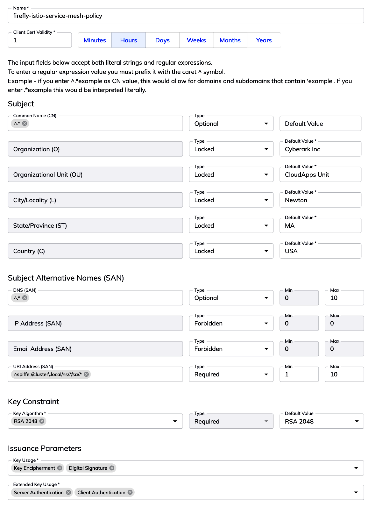

# TLS Protect for Kuberentes & Firefly 

## Requirements  
- You have access to the [Venafi Control Plane](!https://ui.venafi.cloud) and have the entitlements to use 
   - TLS Protect Cloud
   - TLS Protect for Kubernetes
   - Firefly 

## Pre-requisites 
Before you start, there are some requirements to setup the environment.
The demos use a `Makefile` for all operations. Always review the target you are asked to execute. If you prefer to adapt it to another tool, please do. 

- Install the command line tool that we will be using for installing and configuring Venafi components in cluster. You can run `make install-venctl` to do this. Running this comamnd again, will attempt an upgrade if one is available. `venctl` is frequently updated with new capabilities so use `make install-venctl` frequently. 

- Review the file `versions.sh`. You don't need to change it unless you want to pin a component to a specific version. This repo will likely be pinned to latest versions of all the components. The versions in this file will match the output of `venctl components kubernetes manifest print-versions` command. 

- Copy file `vars-template.sh` as `vars.sh`. The `Makefile` uses `vars.sh` to load your specific settings.

    > Replace the value for `VEN_CLOUD_API_KEY` with the value of `apiKey` from your Venafi Control Plane tenant. 

    > Replace the value for `VEN_ZONE_PRIVATE_CA` with the value of the issuing template path. If you don't know what this is, login to Venafi Control Plane, create a issuing template with Venafi BuiltIn CA and create an application. The ZONE is of the form application/issuing-template. Refer to Venafi Control Plane documention for details about how to create an application , assign ownership, etc. 

    > No other variables are required to be setup at this time. We will revisit the other variables as needed. 

- Optionally copy `cloud-settings-template.sh` as `cloud-settings.sh`. This file is optionally included in the `Makefile` and you can use only if you want to automate things in Google Cloud
- All commands from terminal will be executed from the `main` folder. After you clone the repo change the directory to `main` 

- You have created the the required configurations and policies for Firefly to operate in cluster. This is a one time configuration that can be used across all your clusters. Refer to the section [Configuring Venafi Firefly](#configuring-venafi-firefly) to get started. 


## Configuring Venafi Firefly 
Login into [Venafi TLS Protect Cloud](https://ui.venafi.cloud) If you don't have an account you can sign up for a 30 day trial.

### Creating a Team
If you haven't already created a team and assiged members to it. 
- Go to Settings / Teams
- Click New and provide a name and role for the team. For eg, `platform-admin` and Role as `System Administrator`.  Make sure to assign membership. Set the team name in `vars.sh`. The name of the variable is `VEN_TEAM_NAME`

### Creating a Sub CA Provider 
The first step to getting started with **Firefly** is to create a subordinate CA provider. Several upstream CA's are supported but for the purposes of setting up this demo environment 
- Click "Policies / Firefly Sub CA Providers" in left panel 
- Click the "New" -> "Venafi Built-In CA" button. 

> **NOTE** 
> Sub CA Provider can be created using the Venafi APIs as well. [Venafi Developer Central](https://developer.venafi.com) is a good place to start to understand the various APIs and recipes that can be used. 

In the presented screen provide the details for the subordinate CA. An example is included in the screenshot below. The common name for the CA that will be bootstrapped is set as `firefly-built-in-180.svc.cluster.local` with the key algorithm as `RSA 2048`. Set the rest of the subject information that best suits your needs. The sample uses the Venafi Built-In CA. For producton, it is recommended to use the organization's CA.


Make sure to save and review the Sub CA Provider you create. 

### Create a policy for certificates issued by Firefly
As a next step , we will create a policy that will be used by the **Firefly** issuer for issuing certificates in cluster. Venafi Firefly provides a very comprehensive policy model for governing how certificates are issued for workloads. Read the TLS Protect Cloud documentation for various options. 

To create a policy 
- Click "Policies / Firefly Issuance Policies" in left panel 
- Click New and in the presented screen provide the values for the policy. 

All fields are self explanatory. For information about what the "Type" means read the documentation. For e.g Optional means it is optional to provide a value.  Take a look at the sample policy shown below 
- the name of the policy is *firefly-two-day-RSA-certs*
- the validity of all certs issued by **Firefly** is 2 days 
- the subject enforces that common name / DNS SAN must end with For e.g `.svc.cluster.local`
- the rest of the subject fields are locked to a certain value and the information provided in the CSR will be not used. 
- the key constraint is set to "Required" and the only allowed value is **RSA 2048**
- the issuance parameters are set with specific values that will be set in the issued certificate.


Make sure to save and review the policy you create. 

**NOTE** Create two additonal policies similar to above and name them *firefly-ten-day-RSA-certs* and *firefly-hundred-day-RSA-certs* . For the former set the validity to 10 days and for the latter set it to 100 days. 

The idea is to have different policies that cater to different scenarios that *Firefly* will fulfill. 

### Creating a policy for Service mesh usecase

In addition to the above 3 policies, let's create a fourth policy but with slightly different characteristics. This is for signing service mesh worklods using Firefly. 
Similar to how we created a policy before create a new policy called `firefly-istio-service-mesh-policy` You can name it whatever you need it to be. See below for the properties that needs to be set for the policy and also a screenshot.

| Property          | Type |
| :---              |    :----:   | 
| Validity   | 1 Hour        | 
| Commmon Name      | `istiod.istio-system.svc`<br>`^.*`       |
| DNS(SAN)   | `istio-csr.venafi.svc`<br>`cert-manager-istio-csr.venafi.svc`<br>`istiod.istio-system.svc`        | 
| URI Addresss (SAN)   | `^spiffe://cluster\.local/ns/.*/sa/.*`        | 
| Key Constraint   | RSA 2048        | 
| Key Usage   | Key Encipherment <br> Digital Signature        | 
| Extended Key Usage   | Server Authentication <br> Client Authentication        | 




> When you access "Policies / Firefly Issuance Policies" you should see 4 policies in addition to any other you may have created. 


### Creating a configuration for Firefly runtime operations
This is the final step in the process of setting up Firefly for runtime operation. **Firefly** at runtime is associated with a configuration that holds one or more policies. We have created three policies. Each of the policy will cater to different types of workloads associated with a single configuration. 

For e.g the policy created to issue certs with validity of 2 days is likely for highly ephemeral workloads. The 10 day and the 100 day certs may be applicable to different types of workloads.  

To create a configuration,
- Click "Configurations / Firefly Configurations" in the left panel 
- Click New and in the presented screen provide a name and the required fields. 

The required fields on the screen are self explanatory. For addtional details, read the documentation. Sample screenshot available below as well. 
- set the name of the config to `my-firefly-config`
- the selected Sub CA Provider is what we created as a Sub CA Provider. In this example it is `firefly-provider-with-built-in-ca`
- the associated policies are the policy we created earlier. You should associate three policies as shown in the screenshot below. 
- Leave the service account empty for now. You can create a service account manually from "Settings / Service Accounts" if you prefer. In this demo we will be creating it from the CLI and then associate the service account before installing Firefly runtime. 
- Choose None for Client Authentication and Authorization Type. We won't be needing it for this demo. 


Make sure to save and review the configuration you create. 


## Installing Venafi components in cluster

The `Makefile` has several targets and we will walk through all of them to install and configure the Venafi components as listed in the [documentation](!https://docs.venafi.cloud/vaas/k8s-components/c-tlspk-enterprise-components/)

All components will be installed using `venctl` which is a Venafi Kubernetes Manifest utility. More details can be found [here](https://docs.venafi.cloud/vaas/k8s-components/c-vmg-overview/)


### Preparing the cluster to run Venafi components

### STEP 1
Instructions assume that you are running everything from the directory `kubernetes-demos/main` directory

Run 
```
make init-cloud 
```
Running `init-cloud` will 
- create a directory called `artifacts` and all the necessary files required to deploy **Venafi** will be generated here. 
- create two namespaces in your cluster `sandbox` and `venafi` 
- create 3 service accounts that start with name `demo-`. These service accounts can be found in the UI under `Settings / Service Accounts`. Each service account is for a specific purpose and is obvious when you review them in the Venafi Control Plane. 

```
❯ make init-cloud
Service account for certificate discovery
Creating a new service account for the Venafi Kubernetes Agent
 ✅    Running prerequisite checks
Service Account id=XXXXXXXXXXXXXXXXXXXXXXXXXXXXXXXXXXXX
Service account was created successfully file=artifacts/venafi-install/venafi_agent_secret.json format=secret
Creating Service Account in Venafi Control Plane for registry secret
Creating a new service account for Venafi OCI registry
 ✅    Running prerequisite checks
Service Account id=YYYYYYYYYYYYYYYYYYYYYYYYYYYYYYYYYYYY
Service account was created successfully file=artifacts/venafi-install/venafi_registry_secret.json format=secret scopes="[enterprise-cert-manager enterprise-approver-policy enterprise-venafi-issuer]"
Creating Service account in Venafi Control Plane for Firefly
Creating a new service account for the Venafi Firefly
 ✅    Running prerequisite checks
Service Account id=ZZZZZZZZZZZZZZZZZZZZZZZZZZZZZZZZZZZZ
Service account was created successfully file=artifacts/venafi-install/venafi_firefly_secret.json format=secret
namespace/venafi created
namespace/sandbox created
Credentials for venafi registry
secret/venafi-image-pull-secret created
Credentials for certificate discovery
secret/agent-credentials created
Credentials for Venafi Firefly
Credentials for Firefly
secret/venafi-credentials created
```

**NOTE** There is a separate target called `init-dc` that can be used for Venafi TLS Protect Datacenter. You will need to first set the `vars.sh` with the required values.  

### STEP 2

The Venafi Kubernetes Manifest Generator is a handy tool (a helmfile wrapper) that can be used for generating the required manifests. The target to generate the required manifests is `make generate-venafi-manifests`. There is detailed documentation covering a lot of details about how the manifest generator works [here](!https://docs.venafi.cloud/vaas/k8s-components/c-vmg-overview/) The CLI `venctl` is also has detailed help. 

Review the target `generate-venafi-manifests` and you will see what it is trying to do . It reads the required versions to install from `versions.sh`. You can choose which components to install based on the usecases that are relevant to you. In this demo we are installing most of the components. 

Run
```
make generate-venafi-manifests
```
You will see an output that simply says 
`Generating Venafi Helm manifests for installation` 

Review the contents if you want to. The generated file is `artifacts/venafi-install/venafi-manifests.yaml` 

### STEP 3

In this step we will be installing all the Venafi components by simply running the target `install`. One thing to remember before you run install is to associate the service account for the **Firefly** configuration. 
The name of the generated service account is `demo-firefly-<random-number>` 

Go to `Configurations / Firefly Configurations` in the UI and 
- click on the configuration
- click on Service Accounts dropdown and choose `demo-firefly-<random-number>` 
- Save the configuration

Run 
```
make install
```
This command asks for a verbal confirmation asking you if you have associated the service account to **Firefly** configuration. Type `y` to proceed

```
❯ make install
Have you attached the Firefly service account to your config in the UI? [y/N]
```
Typing `y` will start the install process and will take about 2-3 minutes to complete 

Once complete, you should see the following that confirms the installation

```
UPDATED RELEASES:
NAME                         CHART                                      VERSION   DURATION
venafi-connection            venafi-charts/venafi-connection            v0.0.20         1s
venafi-kubernetes-agent      venafi-charts/venafi-kubernetes-agent      0.1.47          9s
cert-manager                 venafi-charts/cert-manager                 v1.14.4        36s
cert-manager-csi-driver      venafi-charts/cert-manager-csi-driver      v0.8.0          1s
approver-policy-enterprise   venafi-charts/approver-policy-enterprise   v0.15.0        23s
venafi-enhanced-issuer       venafi-charts/venafi-enhanced-issuer       v0.13.3        33s
firefly                      venafi-firefly/firefly                     v1.3.3          9s
trust-manager                venafi-charts/trust-manager                v0.9.2         23s
```

All of the above components are installed and running in the `venafi` namespace in your cluster. `make install` uses `venctl` to install the components. By simply adding additional kubernetes contexts, you can install the same configuration on addtional clusters. 

### STEP 4

All certificate requests will denied by default unless there is a policy that automatically approves the certificate requests. Before we create any certificates we need to create some policies. 
Run 
```
make create-certificate-policy
```
to create a `CertificateRequestPolicy`

The output you see will be 

```
certificaterequestpolicy.policy.cert-manager.io/cert-policy-for-venafi-certs created
certificaterequestpolicy.policy.cert-manager.io/cert-policy-for-venafi-firefly-certs created
clusterrole.rbac.authorization.k8s.io/venafi-issuer-cluster-role created
clusterrolebinding.rbac.authorization.k8s.io/venafi-issuer-cluster-role-binding created
```
Run `kubectl get crp` to see the policies. The associated role and rolebinding defines who is allowed. Describe or review policy available at [templates/common/cert-policy-and-rbac.yaml](templates/common/cert-policy-and-rbac.yaml) 

### STEP 5

Creating an issuer. We will now create an issuer using the `ZONE` defined in `vars.sh`. To create an issuer simply run,

```
make create-venafi-cloud-privateca-cluster-issuer 
```
This will create a few new resources. A `VenafiConnection` resource and a `VenafiClusterIssuer` resource. The `VenafiConnection` resource will be in the `venafi` namespace and the cluster issuer is as the name suggests cluster scoped.
The output you see will be 

```
clusterrole.rbac.authorization.k8s.io/read-creds-secret-role-for-venafi-connection created
clusterrolebinding.rbac.authorization.k8s.io/read-creds-secret-role-for-venafi-connection created
secret/venafi-cloud-credentials created
venaficonnection.jetstack.io/venafi-connection created
venaficlusterissuer.jetstack.io/venafi-privateca-cluster-issuer created
```

Run 
```
kubectl get VenafiClusterIssuer
```
and you should see 
```
NAME                              READY   REASON    MESSAGE                         LASTTRANSITION   OBSERVEDGENERATION   GENERATION   AGE
venafi-privateca-cluster-issuer   True    Checked   Succeeded checking the issuer   47s              1                    1            48s
```

### STEP 6
Let's validate that **Firefly** can issue certificates 

Review the file [samples/sample-firefly-certificates.yaml](samples/sample-firefly-certificates.yaml) 

**IMPORTANT** The `policy-name` annotation drives what policy is used for fullfilling the certificate request. The teams requesting certificates just need to know the name of the policy and the required properties to send in the certificate. Many of the certificate properties have been locked by the administrator and/or set as defaults.  The `firefly.venafi.com/policy-name` annotation for each of the three certificates is set to the a different policy.

Run 
```
make create-sample-firefly-certs
```

This will create the certificates in the `sandbox` namespace and can be validated by running,

```
kubectl get Certificate -n sandbox
```
The output will be 

```
NAME                                    READY   SECRET                                  AGE
cert-hundred-days-1.svc.cluster.local   True    cert-hundred-days-1.svc.cluster.local   3m
cert-ten-days-1.svc.cluster.local       True    cert-ten-days-1.svc.cluster.local       3m
cert-two-days-1.svc.cluster.local       True    cert-two-days-1.svc.cluster.local       3m
```

Optionally, look at the associated `CertificateRequest` and `Secret` resources. 
To look at `CertificateRequest` resources run 

```
kubectl get CertificateRequests -n sandbox 
```
The output will be

```
NAME                                          APPROVED   DENIED   READY   ISSUER    REQUESTOR                                         AGE
cert-hundred-days-1.svc.cluster.local-sbw7t   True                True    firefly   system:serviceaccount:venafi:cert-manager   3m
cert-ten-days-1.svc.cluster.local-x6djj       True                True    firefly   system:serviceaccount:venafi:cert-manager   3m
cert-two-days-1.svc.cluster.local-kjsqd       True                True    firefly   system:serviceaccount:venafi:cert-manager   3m
```
Note that the issuer is set to **firefly**

To confirm the validity of each of the certificate optionally run 

Run the following , 
```
kubectl get secret cert-two-days-1.svc.cluster.local -n sandbox -o jsonpath="{.data.tls\.crt}" | base64 -d | openssl x509 -text | grep  CN=cert-two-days-1.svc.cluster.local -B4
```
to see

```
        Issuer: C=US, ST=TX, L=Frisco, O=Venafi Inc, OU=Firefly Unit, CN=firefly-1-20240426195248 firefly-built-in-180.svc.cluster.local
        Validity
            Not Before: Apr 27 01:09:17 2024 GMT
            Not After : Apr 29 01:09:17 2024 GMT
        Subject: C=USA, ST=TX, L=Frisco, O=Venafi Inc, OU=Firefly Unit 3, CN=cert-two-days-1.svc.cluster.local
```

Run the following, 
```
kubectl get secret cert-ten-days-1.svc.cluster.local -n sandbox -o jsonpath="{.data.tls\.crt}" | base64 -d | openssl x509 -text | grep  CN=cert-ten-days-1.svc.cluster.local -B4
```

to see 
```
        Issuer: C=US, ST=TX, L=Frisco, O=Venafi Inc, OU=Firefly Unit, CN=firefly-1-20240426195248 firefly-built-in-180.svc.cluster.local
        Validity
            Not Before: Apr 27 01:09:17 2024 GMT
            Not After : May  7 01:09:17 2024 GMT
        Subject: C=USA, ST=TX, L=Frisco, O=Venafi Inc, OU=Firefly Unit 2, CN=cert-ten-days-1.svc.cluster.local
```

Run the following
```
kubectl get secret cert-hundred-days-1.svc.cluster.local -n sandbox -o jsonpath="{.data.tls\.crt}" | base64 -d | openssl x509 -text | grep  CN=cert-hundred-days-1.svc.cluster.local -B4
```
to see
```
        Issuer: C=US, ST=TX, L=Frisco, O=Venafi Inc, OU=Firefly Unit, CN=firefly-1-20240426195248 firefly-built-in-180.svc.cluster.local
        Validity
            Not Before: Apr 27 01:09:17 2024 GMT
            Not After : Aug  5 01:09:17 2024 GMT
        Subject: C=USA, ST=TX, L=Frisco, O=Venafi Inc, OU=Firefly Unit 1, CN=cert-hundred-days-1.svc.cluster.local
```

## Access the Venafi Control Plane to view the Issuer Certificates and the associated metrics

Access the UI,
- Click "Inventory / Firefly Issuer Certificates" in from the left panel

All the Issuer certificates and the metrics will be presented for the security team to monitor and review as shown below 


### STEP 7

Let's create some addtional certificates in cluster and deploy a few pods to use those certificates. To seed some addtional data simply run

`make seed-data` 

This will create a few secrets, few certificates and a few pods in the `sandbox` namespace.  The output on the screen will display the information. 

If you are operating in a cluster where you may already have a certificates, you don't need to seed any sample data. The purpose of this step is to demonstrate the Venafi discovery capabilities. 
One of the service accounts that we created during the initial step was to setup the discovery of certificates from clusters. 
After about couple of minutes or so login to the UI and access "Installtions / Kubernetes Clusters".
You should see a cluster registered as `demo-cluster-<random number>` 

Click on the cluster name and then click `View Certificates`. Pick one of the certificates, For eg. `cipher-snake.svc.cluster.local` and click on it. Review the details. You will notice that the Key size is likely non-compliant. Review the `Installations` by clicking on it. Expand the cluster resources to find that this certificate is actually in use in a workload and it's lifecycle is not managed at all. 

Addtional exercise: Optionally, you can have TLS Protect Datacenter pull this discovered data into a policy folder as well.  


# Configure Firefly to sign Istio mesh workloads

Now that we have validated Firefly and have issued a few certificates let us extend our Firefly setup to sign all incoming Istio mesh workloads. In this section we will be installing a few additional components in the cluster. 

## Setting up Istio and the required components

As always, review each target before you run to understand what exactly will be executed. 

### STEP 1

We will create a couple of namespaces `istio-system` and `mesh-apps`. Review `namespaces/mesh-apps.yaml` and you will notice that we have a label `istio-injection: enabled` to ensure all workloads are mesh enabled. 

Additionally, review [templates/helm/istio-csr-values.yaml](templates/helm/istio-csr-values.yaml) This is the chart that configures how Venafi cert-manager istio-csr is installed and configured. 
- You will note that there is a specific annotation that tells istio-csr what policy to use for signing all mesh workloads. In this demo, the policy used is `firefly-istio-service-mesh-policy`
- You wil notice a reference to `firefly-mesh-wi-issuer`. This is the issuer that will be used for signing all incoming mesh workloads. 

Run
```
make mesh-step1
```

This will create two namespaces and and a *Firefly* issuer. You should see the below output 
```
namespace/istio-system created
namespace/mesh-apps created
issuer.firefly.venafi.com/firefly-mesh-wi-issuer created
```

### STEP 2
istio-csr requires a trust anchor that needs to be mounted when installed. The reference to `ca.crt` in [templates/helm/istio-csr-values.yaml](templates/helm/istio-csr-values.yaml) is for the trust anchor. 

Before you run the target for `step2` review the target `make-step2`. This target calls another target called `_create_sourceCA`. The variable `VEN_TRUST_ANCHOR_ROOT_CA_PEM` should be set in the `vars.sh`. The value will be a path to a PEM file that acts as the trust anchor. The referred PEM file does not exist in the repo. You will need to create it. 

Run 
```
make mesh-step2
```

Running the target produces the below output. A trust-manager managed `Bundle` called `venafi-firefly-trust-anchor` is created that is automatically managed. `istio-csr` uses the `Bundle` and will make it automatically available if/when `secret/venafi-trust-anchor` changes.  
```
❯ make mesh-step2
secret/venafi-trust-anchor created
Creating Firefly trust anchor
bundle.trust.cert-manager.io/venafi-firefly-trust-anchor created
```
Review the `Bundle` by simply running, 

```
kubectl describe Bundle -n istio-system 
```
and you will see 

```
Events:
  Type    Reason  Age    From     Message
  ----    ------  ----   ----     -------
  Normal  Synced  2m47s  bundles  Successfully synced Bundle to namespaces that match this label selector: issuer=venafi-firefly
```

### STEP 3
With all the pre-requisites for istio-csr taken care of, we will now install it using Helm. 
Run 
```
make mesh-step3
```
and you will see the following output 
```
❯ make mesh-step3
Installing Venafi istio CSR agent.....
Release "cert-manager-istio-csr" does not exist. Installing it now.
Pulled: private-registry.venafi.cloud/charts/cert-manager-istio-csr:v0.8.1
Digest: sha256:0986900f0ec5e52c023da59f420039bc4d80fcdf0ee84795f471bb3e33dbcb6d
NAME: cert-manager-istio-csr
LAST DEPLOYED: Fri Apr 26 20:48:57 2024
NAMESPACE: venafi
STATUS: deployed
REVISION: 1
TEST SUITE: None
```

Validate that all the components are running using
```
kubectl get pods -n venafi
```
and you should see 

```
NAME                                            READY   STATUS    RESTARTS   AGE
cert-manager-5ff95778f4-ttbfz                   1/1     Running   0          58m
cert-manager-approver-policy-5bb776797f-z42m6   1/1     Running   0          57m
cert-manager-cainjector-6b9c5fffd5-fb487        1/1     Running   0          58m
cert-manager-csi-driver-r85pp                   3/3     Running   0          57m
cert-manager-istio-csr-6f9d6c846b-4pzkk         1/1     Running   0          47s
cert-manager-webhook-84545cd465-st7kt           1/1     Running   0          58m
firefly-84b44bdb77-hj5r6                        1/1     Running   0          56m
firefly-84b44bdb77-htdqs                        1/1     Running   0          56m
trust-manager-667ddb8554-dplp5                  1/1     Running   0          56m
venafi-enhanced-issuer-f59c984f5-6vm56          1/1     Running   0          57m
venafi-enhanced-issuer-f59c984f5-psjpl          1/1     Running   0          57m
venafi-kubernetes-agent-865f8c68b9-9q9c7        1/1     Running   0          58m
```

Additionally, this also creates the `istiod` certificate that will be bootstrapped to Istio

Review the certificate created by Firefly for Istio by running
```
kubectl get certificate istiod -n istio-system
```
You can additonally inspect the secret bootstrapped to Istio by running 
```
 kubectl get secret istiod-tls -n istio-system -o jsonpath="{.data.tls\.crt}" | base64 -d | openssl x509 -text | grep Issuer -A4
```
and you should see 
```
        Issuer: C=US, ST=TX, L=Frisco, O=Venafi Inc, OU=Firefly Unit, CN=firefly-1-20240426195248 firefly-built-in-180.svc.cluster.local
        Validity
            Not Before: Apr 27 01:48:57 2024 GMT
            Not After : Apr 27 02:48:57 2024 GMT
        Subject: CN=istiod.istio-system.svc
```
This is the `istiod` secret that Istio will use for signing all incoming mesh workloads. 

### STEP 4

We will now install Istio by running the following. Istio is installed using the `IstioOperator` . The file is located at [templates/servicemesh/istio-config.yaml](templates/servicemesh/istio-config.yaml) for review. Note the `caAddress` and the setting for `CA_SERVER`. The `caAddress` points to `istio-csr` service and the built in `CA_SERVER` is turned off. 

Run 
```
make mesh-step4 
```
and you should see
```
❯ make mesh-step4
✔ Istio core installed                                                                                                                         
✔ Istiod installed                                                                                                                             
✔ Egress gateways installed                                                                                                                    
✔ Ingress gateways installed                                                                                                                   
✔ Installation complete                                                                                                                        Making this installation the default for injection and validation.

Thank you for installing Istio 1.17.
```

### STEP 5
In this step we will create a `PeerAuthentication` to ensure all workloads communicate to each other STRICTLY using mTLS. 

Run
```
make mesh-step5
```
You will see 
```
peerauthentication.security.istio.io/global created
```
Let's inspect the `PeerAuthentication` resource by running 
```
kubectl get PeerAuthentication -n istio-system
```
to see that mTLS mode is set to STRICT
```
NAME     MODE     AGE
global   STRICT   55s
```

### STEP 6 - **Optional**
While all the mesh workloads will use **Firefly** for their identities, we also need a public certificate to access the Ingress Gateway. The sample application that we will eventually deploy will be accessed from the browser. Venafi will issue a public certificate that is trusted by the browser. The certificate will be issued by a `VenafiClusterIssuer`. 
The template for issuer is located here [templates/cloud/venafi-cloud-publicca-cluster-issuer.yaml](templates/cloud/venafi-cloud-publicca-cluster-issuer.yaml) 
The template for certificate is located here [templates/cloud/venafi-cloud-managed-public-cert.yaml](templates/cloud/venafi-cloud-managed-public-cert.yaml)

If you don't need to attach a certificate for your Gateway you can ignore this step.

There are two options for this step. Either using Venafi Cloud or the data center to issue a public certificate. You are also required to set the variable `VEN_ZONE_PUBLIC_CA` and `VEN_DOMAIN_FOR_SAMPLE_APP` The Zone is used for issuing a publicly trusted certificate. You can issue a private certificate if your browser configured to trust the CA. The DNS will be used to configured the Gateway.  The target to get a certificate from Venafi cloud is `mesh-step6-cloud` and from data center is `mesh-step6-tpp`

Run 
```
make mesh-step6-cloud
```
to create an issuer and certificate. You will see the following output 
```
❯ make mesh-step6-cloud
venaficlusterissuer.jetstack.io/venafi-publicca-cluster-issuer created
certificate.cert-manager.io/5419352604.example.com created
```

### STEP7 - **Optional**
This is an optional step and will require you to adapt depending on where your cluster is running and if you need create a DNS entry to access the gateway. 
This demo is setup on GKE with loadbalancer / domains managed by GCP. If this is not applicable to you, review the target and create appropriate DNS entries. 
You are also **REQUIRED** to setup `cloud-settings.sh` and configure your Google Project settings.  

Basically, you need to run 
```
kubectl get svc istio-ingressgateway -n istio-system
```
and associate the provisioned loadblancer IP/hostname to your DNS. 
**If you are not using Google Cloud, skip this step. 
To automatically do that in Google Cloud for a domain you own, just run
```
make mesh-step7
```

### STEP 8
It's time to deploy a sample application. The sample application will be deployed in a namespace called `mesh-apps`. 
Run
```
make mesh-step8
```

Validate that the sample app is deployed. Run ,
```
kubectl get pods -n mesh-apps
```
to see
```
NAME                             READY   STATUS    RESTARTS   AGE
details-v1-698d88b-7jbpw         2/2     Running   0          29s
productpage-v1-675fc69cf-lczlb   2/2     Running   0          29s
ratings-v1-6484c4d9bb-gxf48      2/2     Running   0          29s
reviews-v1-5b5d6494f4-j754q      2/2     Running   0          29s
reviews-v2-5b667bcbf8-mlvhm      2/2     Running   0          29s
reviews-v3-5b9bd44f4-cs8bx       2/2     Running   0          29s
```

Let's validate that the certificates issued to all the mesh workloads are indeed issued by **Firefly**

Run
```
make print-svid
```
`print-svid` is a target that prints the cert assoicated with ratings. You can choose to change the script to look at other certificates as well. You will see an output similar to below

```
❯ make print-svid
Pod name is ratings-v1-6484c4d9bb-gxf48 
Warning: Reading certificate from stdin since no -in or -new option is given
Certificate:
    Data:
        Version: 3 (0x2)
        Serial Number:
            25:c7:fa:df:94:22:ab:69:70:dd:2a:0b:2c:b1:96:7f
        Signature Algorithm: sha256WithRSAEncryption
        Issuer: C=US, ST=TX, L=Frisco, O=Venafi Inc, OU=Firefly Unit, CN=firefly-1-20240426195248 firefly-built-in-180.svc.cluster.local
        Validity
            Not Before: Apr 27 02:07:19 2024 GMT
            Not After : Apr 27 03:07:19 2024 GMT
```
The mesh identity is valid for 1 hour as defined by a policy in the Venafi Control Plane. Access Venafi Control Plane and the dashboard to review the metrics associated with this issuer. 