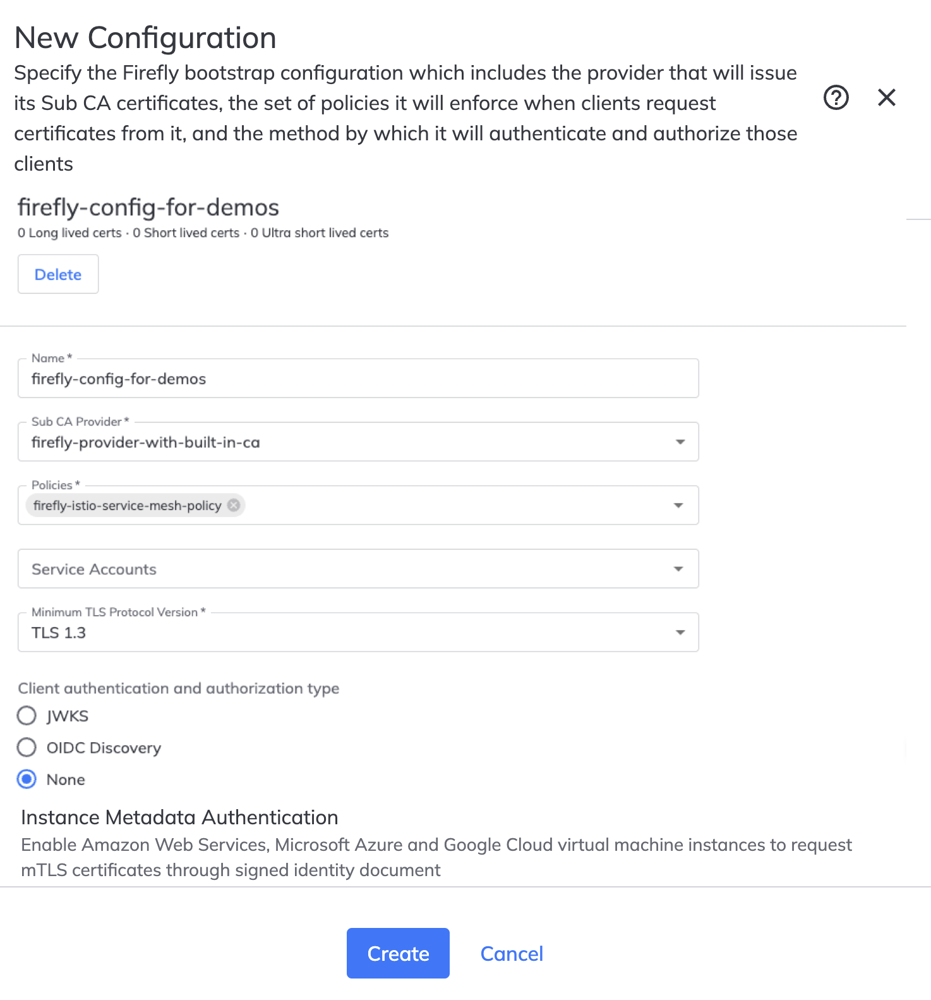

# TLS Protect for Kuberentes & Firefly 
This README has instructions to install and configure Venafi components with the assumption that you have a functional cert-manager already installed and running. 

## Requirements  
- You have access to the [Venafi Control Plane](!https://ui.venafi.cloud) and have the entitlements to use 
   - TLS Protect Cloud
   - TLS Protect for Kubernetes
   - Firefly 

## Pre-requisites 
Before you start, there are some requirements to setup the environment.
The demos use a `Makefile` for all operations. Always review the target you are asked to execute. If you prefer to adapt it to another tool, please do. 

- Install the command line tool that we will be using for installing and configuring Venafi components in cluster. You can run `make install-venctl` to do this. Running this comamnd again, will attempt an upgrade if one is available. `venctl` is frequently updated with new capabilities so use `make install-venctl` frequently. 

- Review the file `versions.sh`. You don't need to change it unless you want to pin a component to a specific version. This repo will likely be pinned to latest versions of all the components. The versions in this file will match the output of `venctl components kubernetes manifest print-versions` command. 

- Copy file `vars-template.sh` as `vars.sh`. The `Makefile` uses `vars.sh` to load your specific settings.

    > Replace the value for `VEN_CLOUD_API_KEY` with the value of `apiKey` from your Venafi Control Plane tenant. 

    > Replace the value for `VEN_ZONE_PRIVATE_CA` with the value of the issuing template path. If you don't know what this is, login to Venafi Control Plane, create a issuing template with Venafi BuiltIn CA and create an application. The ZONE is of the form application/issuing-template. Refer to Venafi Control Plane documentation for details about how to create an application , assign ownership, etc. 

    > Replace the value `VEN_TEAM_NAME` with the name of the team created in Venafi Control Plane

    > Replace the value `VEN_NAMESPACE` with the name of the namespace where cert-manager is currently installed and running. This set of instructions will assume you have a functional cert-manager in the cluster. 

    > Replace the value for `VEN_REGISTRY_SECRET_YAML` with the path to `YAML` file that has the registry access secret. This can be downloaded after creating a service account in Venafi Control Plane. 

    > Replace the value for `VEN_FIREFLY_PRIVATE_KEY` with the path to `YAML` file that has the private key associated with Firefly service account. This can be copied from Venafi Control Plane after create a service account for Firefly.

    > Replace the value for `VEN_FIREFLY_SA_CLIENT_ID` with the `client-id` associated with the Firefly service account. 

- All commands from terminal will be executed from the `ven03` folder. After you clone the repo change the directory to `projects/ven03` 

- You have created the the required configurations and policies for Firefly to operate in cluster. This is a one time configuration that can be used across all your clusters. Refer to the section [Configuring Venafi Firefly](#configuring-venafi-firefly) to get started. 


# The following section is applicable to Security team only. The steps will walk through configuring Firefly in the Venafi Control Plane. If you are a platform engineer skip this section.

## Configuring Venafi Firefly 
Login into [Venafi TLS Protect Cloud](https://ui.venafi.cloud) If you don't have an account you can sign up for a 30 day trial.

### Creating a Team
If you haven't already created a team and assiged members to it. 
- Go to Settings / Teams
- Click New and provide a name and role for the team. For eg, `platform-admin` and Role as `System Administrator`.  Make sure to assign membership. Set the team name in `vars.sh` if you haven't already. The name of the variable is `VEN_TEAM_NAME`

### Creating a Sub CA Provider 
The first step to getting started with **Firefly** is to create a subordinate CA provider. Several upstream CA's are supported but for the purposes of setting up this demo environment 
- Click "Policies / Firefly Sub CA Providers" in left panel 
- Click the "New" -> "Venafi Built-In CA" button. 

> **NOTE** 
> Sub CA Provider can be created using the Venafi APIs as well. [Venafi Developer Central](https://developer.venafi.com) is a good place to start to understand the various APIs and recipes that can be used. 

In the presented screen provide the details for the subordinate CA. An example is included in the screenshot below. The common name for the CA that will be bootstrapped is set as `firefly-built-in-180.svc.cluster.local` with the key algorithm as `RSA 2048`. Set the rest of the subject information that best suits your needs. The sample uses the Venafi Built-In CA. For producton, it is recommended to use the organization's CA.


Make sure to save and review the Sub CA Provider you create. 

### Create a policy for certificates issued by Firefly
As a next step , we will create a policy that will be used by the **Firefly** issuer for issuing certificates in cluster. Venafi Firefly provides a very comprehensive policy model for governing how certificates are issued for workloads. Read the TLS Protect Cloud documentation for various options. 

To create a policy 
- Click "Policies / Firefly Issuance Policies" in left panel 
- Click New and in the presented screen provide the values for the policy. 

All fields are self explanatory. For information about what the "Type" means read the documentation. For e.g Optional means it is optional to provide a value.  Take a look at the sample policy shown below 
- the name of the policy is *firefly-two-day-RSA-certs*
- the validity of all certs issued by **Firefly** is 2 days 
- the subject enforces that common name / DNS SAN must end with For e.g `.svc.cluster.local`
- the rest of the subject fields are locked to a certain value and the information provided in the CSR will be not used. 
- the key constraint is set to "Required" and the only allowed value is **RSA 2048**
- the issuance parameters are set with specific values that will be set in the issued certificate.


Make sure to save and review the policy you create. 

**NOTE** Create two additonal policies similar to above and name them *firefly-ten-day-RSA-certs* and *firefly-hundred-day-RSA-certs* . For the former set the validity to 10 days and for the latter set it to 100 days. 

The idea is to have different policies that cater to different scenarios that *Firefly* will fulfill. 

> When you access "Policies / Firefly Issuance Policies" you should see 3 policies in addition to any other you may have created. 

### Creating a configuration for Firefly runtime operations
This is the final step in the process of setting up Firefly for runtime operation. **Firefly** at runtime is associated with a configuration that holds one or more policies. We have created three policies. Each of the policy will cater to different types of workloads associated with a single configuration. 

For e.g the policy created to issue certs with validity of 2 days is likely for highly ephemeral workloads. The 10 day and the 100 day certs may be applicable to different types of workloads.  

To create a configuration,
- Click "Configurations / Firefly Configurations" in the left panel 
- Click New and in the presented screen provide a name and the required fields. 

The required fields on the screen are self explanatory. For addtional details, read the documentation. Sample screenshot available below as well. 
- set the name of the config to `my-firefly-config`
- the selected Sub CA Provider is what we created as a Sub CA Provider. In this example it is `firefly-provider-with-built-in-ca`
- the associated policies are the policy we created earlier. You should associate three policies as shown in the screenshot below. 
- Leave the service account empty for now. You can create a service account manually from "Settings / Service Accounts" if you prefer. In this demo we will be creating it from the CLI and then associate the service account before installing Firefly runtime. 
- Choose None for Client Authentication and Authorization Type. We won't be needing it for this demo. 




Make sure to save and review the configuration you create. 

# The following section is applicable to Platform team only. The steps will walk through installation of Venafi components in cluster. 

**NOTE**
> Make sure your `vars.sh` is setup as documented in the Pre-requisites section.

## Installing Venafi components in cluster

The `Makefile` has several targets and we will walk through all of them to install and configure the Venafi components as listed in the [documentation](!https://docs.venafi.cloud/vaas/k8s-components/c-tlspk-enterprise-components/)

All components will be installed using `venctl` which is a Venafi Kubernetes Manifest utility. More details can be found [here](https://docs.venafi.cloud/vaas/k8s-components/c-vmg-overview/)


### Preparing the cluster to run Venafi components

### STEP 1
Instructions assume that you are running everything from the directory `kubernetes-demos/projects/ven03` directory

This set of instructions assume that you have an existing `cert-manager` installation in your cluster. On a fresh cluster, it is recommended to install all enterprise components. This readme specifically addresses a scenario where users may have cert-manager already functional and add the rest of enterprise components to address addtional usecases. 

Run 
```
make init-cloud 
```
Running `init-cloud` will 
- create a directory called `artifacts` and all the necessary files required to deploy **Venafi** will be generated here. 
- create a namespace in your cluster called `sandbox` for sample certs.
- create a image registry secret in the namespace where cert-manager is already deployed
- create a secret for Firefly to connect to Venafi Control Plane in the namespace where cert-manager is already deployed

The output running `make init-cloud` will look as below. 
```
❯ make init-cloud
namespace/sandbox created
Credentials for venafi registry
secret/venafi-image-pull-secret created
Credentials for Firefly
secret/venafi-credentials created
```

### STEP 2

**NOTE** 
> In the previous step a service account was created. This service account needs to be associated with the Firefly configuration in the UI. If you do not have access to the Venafi UI, ask the security team to associate the service account to the Venafi Firefly configuration. 

The Venafi Kubernetes Manifest Generator is a handy tool (a helmfile wrapper) that can be used for generating the required manifests. The target to generate the required manifests is `make generate-venafi-manifests`. There is detailed documentation covering a lot of details about how the manifest generator works [here](!https://docs.venafi.cloud/vaas/k8s-components/c-vmg-overview/) The CLI `venctl` is also has detailed help. 

Review the target `generate-venafi-manifests` and you will see what it is trying to do . It reads the required versions to install from `versions.sh`. You can choose which components to install based on the usecases that are relevant to you. In this demo we are installing most of the components. 

Run
```
make generate-venafi-manifests
```
You will see an output that simply says 
`Generating Venafi Helm manifests for installation` 

Review the contents if you want to. The generated file is `artifacts/venafi-install/venafi-manifests.yaml` 

---
**NOTE**
Follow this note only if you have cert-manager already installed in the cluster. 
The generated manifest will require some edits as cert-manager is currently installed. We need to remove references to where cert-manager is set in the `needs`. You can search for `needs` and delete the line `- cert-manager` . 
```
needs:
- cert-manager
```

---

### STEP 3

In this step we will be installing all the Venafi components by simply running the target `install`. 
Run 
```
make install
```

Once complete, you should see the following that confirms the installation

```
UPDATED RELEASES:
NAME                         NAMESPACE               CHART                                      VERSION   DURATION
venafi-connection            cert-manager-operator   venafi-charts/venafi-connection            v0.0.20         1s
cert-manager-csi-driver      cert-manager-operator   venafi-charts/cert-manager-csi-driver      v0.8.0          1s
approver-policy-enterprise   cert-manager-operator   venafi-charts/approver-policy-enterprise   v0.16.0        23s
firefly                      cert-manager-operator   venafi-firefly/firefly                     v1.3.4         11s
venafi-enhanced-issuer       cert-manager-operator   venafi-charts/venafi-enhanced-issuer       v0.13.3        33s
trust-manager                cert-manager-operator   venafi-charts/trust-manager                v0.9.2         37s

```

By simply adding additional kubernetes contexts, you can install the same configuration on addtional clusters. 

### STEP 4

All certificate requests will denied by default unless there is a policy that automatically approves the certificate requests. Before we create any certificates we need to create some policies. 
Run 
```
make create-certificate-policy
```
to create a `CertificateRequestPolicy`

The output you see will be 

```
certificaterequestpolicy.policy.cert-manager.io/cert-policy-for-venafi-certs created
certificaterequestpolicy.policy.cert-manager.io/cert-policy-for-venafi-firefly-certs created
clusterrole.rbac.authorization.k8s.io/venafi-issuer-cluster-role created
clusterrolebinding.rbac.authorization.k8s.io/venafi-issuer-cluster-role-binding created
```
Run `kubectl get crp` to see the policies. The associated role and rolebinding defines who is allowed. Describe or review policy available at [templates/common/cert-policy-and-rbac.yaml](templates/common/cert-policy-and-rbac.yaml) 

### STEP 5

Creating an issuer. We will now create an issuer using the `ZONE` defined in `vars.sh`. To create an issuer simply run,

```
make create-venafi-cloud-privateca-cluster-issuer 
```
This will create a few new resources. A `VenafiConnection` resource and a `VenafiClusterIssuer` resource. The `VenafiConnection` resource will be in the `venafi` namespace and the cluster issuer is as the name suggests cluster scoped.
The output you see will be 

```
clusterrole.rbac.authorization.k8s.io/read-creds-secret-role-for-venafi-connection created
clusterrolebinding.rbac.authorization.k8s.io/read-creds-secret-role-for-venafi-connection created
secret/venafi-cloud-credentials created
venaficonnection.jetstack.io/venafi-connection created
venaficlusterissuer.jetstack.io/venafi-privateca-cluster-issuer created
```

Run 
```
kubectl get VenafiClusterIssuer
```
and you should see 
```
NAME                              READY   REASON    MESSAGE                         LASTTRANSITION   OBSERVEDGENERATION   GENERATION   AGE
venafi-privateca-cluster-issuer   True    Checked   Succeeded checking the issuer   47s              1                    1            48s
```

### STEP 6
Let's validate that **Firefly** can issue certificates 

Review the file [samples/sample-firefly-certificates.yaml](samples/sample-firefly-certificates.yaml) 

**IMPORTANT** The `policy-name` annotation drives what policy is used for fullfilling the certificate request. The teams requesting certificates just need to know the name of the policy and the required properties to send in the certificate. Many of the certificate properties have been locked by the administrator and/or set as defaults.  The `firefly.venafi.com/policy-name` annotation for each of the three certificates is set to the a different policy.

Run 
```
make create-sample-certs
```

This will create the certificates in the `sandbox` namespace and can be validated by running,

```
kubectl get Certificate -n sandbox
```
The output will be 

```
NAME                                    READY   SECRET                                  AGE
cert-hundred-days-1.svc.cluster.local   True    cert-hundred-days-1.svc.cluster.local   20s
cert-ten-days-1.svc.cluster.local       True    cert-ten-days-1.svc.cluster.local       20s
cert-two-days-1.svc.cluster.local       True    cert-two-days-1.svc.cluster.local       20s
sample-cert01.svc.cluster.local         True    sample-cert01.svc.cluster.local         20s
```

Optionally, look at the associated `CertificateRequest` and `Secret` resources. 
To look at `CertificateRequest` resources run 

```
kubectl get CertificateRequests -n sandbox 
```
The output will be

```
NAME                                      APPROVED   DENIED   READY   ISSUER                            REQUESTOR                                                  AGE
cert-hundred-days-1.svc.cluster.local-1   True                True    firefly                           system:serviceaccount:cert-manager-operator:cert-manager   72s
cert-ten-days-1.svc.cluster.local-1       True                True    firefly                           system:serviceaccount:cert-manager-operator:cert-manager   72s
cert-two-days-1.svc.cluster.local-1       True                True    firefly                           system:serviceaccount:cert-manager-operator:cert-manager   72s
sample-cert01.svc.cluster.local-1         True                True    venafi-privateca-cluster-issuer   system:serviceaccount:cert-manager-operator:cert-manager   71s
```

Note that the issuer is set to **firefly**

To confirm the validity of each of the certificate optionally run 

Run the following , 
```
kubectl get secret cert-two-days-1.svc.cluster.local -n sandbox -o jsonpath="{.data.tls\.crt}" | base64 -d | openssl x509 -text | grep  CN=cert-two-days-1.svc.cluster.local -B4
```
to see

```
        Issuer: C=US, ST=TX, L=Frisco, O=Venafi Inc, OU=Firefly Unit, CN=firefly-1-20240426195248 firefly-built-in-180.svc.cluster.local
        Validity
            Not Before: Apr 27 01:09:17 2024 GMT
            Not After : Apr 29 01:09:17 2024 GMT
        Subject: C=USA, ST=TX, L=Frisco, O=Venafi Inc, OU=Firefly Unit 3, CN=cert-two-days-1.svc.cluster.local
```

Run the following, 
```
kubectl get secret cert-ten-days-1.svc.cluster.local -n sandbox -o jsonpath="{.data.tls\.crt}" | base64 -d | openssl x509 -text | grep  CN=cert-ten-days-1.svc.cluster.local -B4
```

to see 
```
        Issuer: C=US, ST=TX, L=Frisco, O=Venafi Inc, OU=Firefly Unit, CN=firefly-1-20240426195248 firefly-built-in-180.svc.cluster.local
        Validity
            Not Before: Apr 27 01:09:17 2024 GMT
            Not After : May  7 01:09:17 2024 GMT
        Subject: C=USA, ST=TX, L=Frisco, O=Venafi Inc, OU=Firefly Unit 2, CN=cert-ten-days-1.svc.cluster.local
```

Run the following
```
kubectl get secret cert-hundred-days-1.svc.cluster.local -n sandbox -o jsonpath="{.data.tls\.crt}" | base64 -d | openssl x509 -text | grep  CN=cert-hundred-days-1.svc.cluster.local -B4
```
to see
```
        Issuer: C=US, ST=TX, L=Frisco, O=Venafi Inc, OU=Firefly Unit, CN=firefly-1-20240426195248 firefly-built-in-180.svc.cluster.local
        Validity
            Not Before: Apr 27 01:09:17 2024 GMT
            Not After : Aug  5 01:09:17 2024 GMT
        Subject: C=USA, ST=TX, L=Frisco, O=Venafi Inc, OU=Firefly Unit 1, CN=cert-hundred-days-1.svc.cluster.local
```

## Access the Venafi Control Plane to view the Issuer Certificates and the associated metrics

Access the UI,
- Click "Inventory / Firefly Issuer Certificates" in from the left panel

All the Issuer certificates and the metrics will be presented for the security team to monitor and review as shown below 


